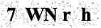

# captcha-input-char-utils 模块说明

> 输入型字符 验证码 utils 模块

## 功能说明

* 生成输入型字符 验证码图片 / Base64 字符串。

## 使用

该模块提供一个 `InputCharCaptchaUtils` 工具类，可根据传入的若干个字符，生成验证码图片。

```java

public class CharCaptchaUtilsTest {

    public static void main(String[] args) throws IOException {
        // 验证码个数
        int codeNum = 5;

        // 创建输入型字符 验证码工具类
        InputCharCaptchaUtils captchaUtils = new InputCharCaptchaUtils(codeNum, codeNum * 25, 35, 200, 2);

        // 创建验证码
        // 也可自己定义验证码
        String code = captchaUtils.createCode();

        // 根据验证码生成图片，将该图片转成 Base64 字符串
        String imageByBase64 = captchaUtils.createImageByBase64(code);

        code = RandomStringUtils.randomAlphanumeric(codeNum);

        // 根据验证码生成图片，将该图片转成 ByteArrayOutputStream
        ByteArrayOutputStream imageByStream = captchaUtils.createImageByStream(code);

        code = RandomStringUtils.randomAlphanumeric(codeNum);

        // 根据验证码生成图片，将该图片转成指定的 OutputStream
        ByteArrayOutputStream outputStream = new ByteArrayOutputStream();
        captchaUtils.createImageByStream(code, outputStream);

        System.out.println();
    }

}

```

验证码效果图如下：


