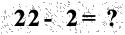

# captcha-input-math-utils 模块说明

> 输入型算数 验证码 utils 模块

## 使用

该模块提供一个 `CaptchaUtils` 工具类，可根据传入的数字，生成随机地加减乘除验证码图片。

```java

public class MathCaptchaUtilsTest {

    public static void main(String[] args) throws IOException {
        // 验证码最小值
        int minCode = 10;

        // 验证码最大值
        int maxCode = 99;

        // 创建输入型算数 验证码工具类
        CaptchaUtils captchaUtils = new CaptchaUtils(10, 99,
                (String.valueOf(maxCode).length() + 3) * 25,
                35, 200, 2);

        // 生成验证码
        // 也可自己定义验证码
        int code = captchaUtils.createCode();

        // 根据验证码生成图片，将该图片转成 Base64 字符串
        String imageByBase64 = captchaUtils.createImageByBase64(code);

        code = RandomUtils.nextInt(minCode, maxCode);

        // 根据验证码生成图片，将该图片转成 ByteArrayOutputStream
        ByteArrayOutputStream imageByStream = captchaUtils.createImageByStream(code);

        code = RandomUtils.nextInt(minCode, maxCode);

        // 根据验证码生成图片，将该图片转成指定的 OutputStream
        ByteArrayOutputStream outputStream = new ByteArrayOutputStream();
        captchaUtils.createImageByStream(code, outputStream);

        System.out.println();
    }

}

```

验证码效果图如下：


